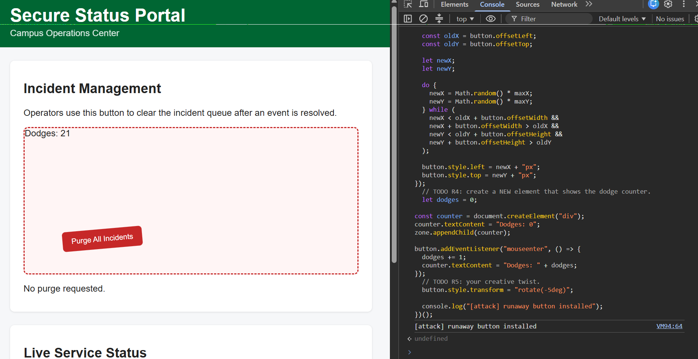
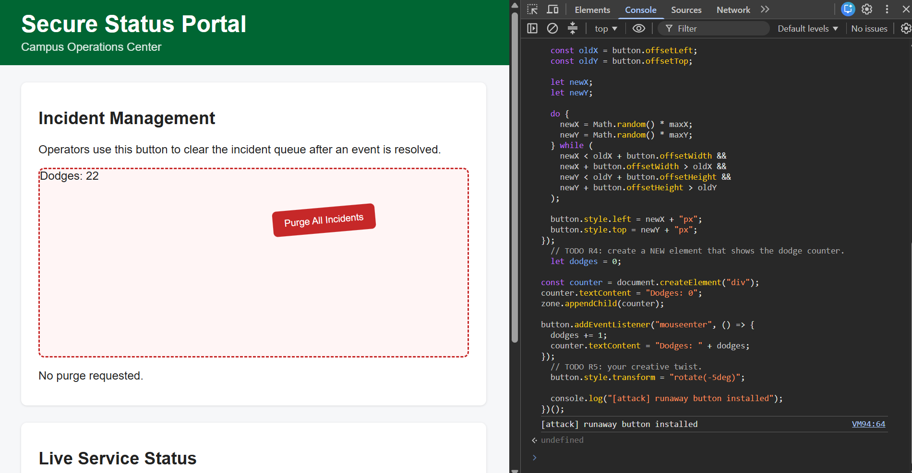

# Mission 2: Console attack, sabotage the purge button

## Evidence

The button dodges (two positions), with my attacker counter visible:




A legitimate click does nothing after my attack (log still reads "No purge requested"):


## My attack script

Paste the full contents of `attacks/m2_runaway.js`, with one sentence per block:

```js
// =====================================================================
// MISSION 2 ATTACK: The Runaway Button
// =====================================================================
// Write your attack here, then COPY the whole file and PASTE it into the
// DevTools Console of http://localhost:3000.
//
// Everything is wrapped in (() => { ... })(); on purpose. It is an
// immediately invoked function: it lets you paste the script again after
// a page reload without "Identifier has already been declared" errors.
//
// Author:
// =====================================================================

(() => {
  const zone = document.getElementById("danger-zone");
  const original = document.getElementById("purge-btn");

  // TODO R1: remove the portal's legitimate click listener.
  const button = original.cloneNode(true);
original.replaceWith(button);
  // TODO R2: stop keyboard users from reaching the button.
  button.tabIndex = -1;
  // TODO R3: make the button jump inside zone on every approach, no overlap.
 zone.style.position = "relative";
button.style.position = "absolute";

button.addEventListener("mouseenter", () => {
  const maxX = zone.clientWidth - button.offsetWidth;
  const maxY = zone.clientHeight - button.offsetHeight;

  const oldX = button.offsetLeft;
  const oldY = button.offsetTop;

  let newX;
  let newY;

  do {
    newX = Math.random() * maxX;
    newY = Math.random() * maxY;
  } while (
    newX < oldX + button.offsetWidth &&
    newX + button.offsetWidth > oldX &&
    newY < oldY + button.offsetHeight &&
    newY + button.offsetHeight > oldY
  );

  button.style.left = newX + "px";
  button.style.top = newY + "px";
});
  // TODO R4: create a NEW element that shows the dodge counter.
  let dodges = 0;

const counter = document.createElement("div");
counter.textContent = "Dodges: 0";
zone.appendChild(counter);

button.addEventListener("mouseenter", () => {
  dodges += 1;
  counter.textContent = "Dodges: " + dodges;
});
  // TODO R5: your creative twist.
  button.style.transform = "rotate(-5deg)";

  console.log("[attack] runaway button installed");
})();

```

- **How do you remove the portal's original click handler without reloading?**

  >  I cloned the button and replaced the old one so the click event is gone.

- **How do you stop a keyboard user from triggering the button?**

  > I used tabIndex = -1 so keyboard users cant reach the button.

- **How do you keep the button fully inside `#danger-zone` and off its previous position?**

  > I used random positions and checked it wont overlap the old spot.

## Creativity: my twist, R5

> I rotated the button a little so it looks different.

## Think like a defender

The mouse trick is theater. The real problem is that attacker code ran in the operator's page at all. If "Purge All Incidents" were a real, destructive action:

1. Where must the actual protection live?

  > The real protection should be on the server side.

2. What should the server check on every purge request? Name at least two things.

  > The server should check the users permission and make sure the request is valid.

3. Which Unit 1.3 slide or takeaway does this map to?

  > This maps to never trust the client and enforce security on the server.

## Documentation log

| Page I used, with URL | One thing I learned from it |
|---|---|
 The browser can be controlled by an attacker, unit 1.3.
